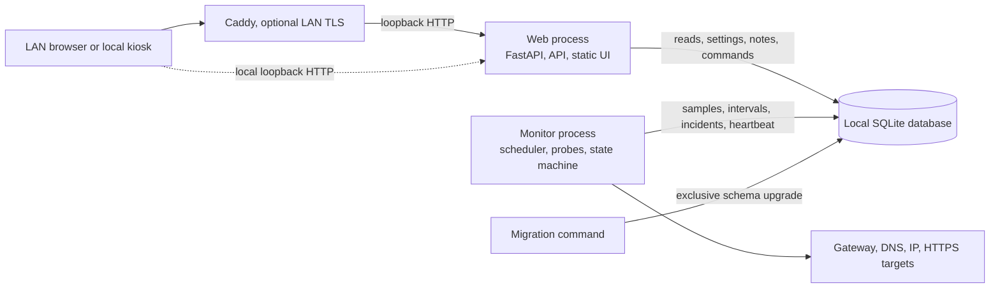

# V1 architecture

Status: accepted for implementation, subject to Raspberry Pi host inventory and
hardware validation.

This document defines the V1 component boundaries and operational model. It
applies equally to Raspberry Pi 3 and Raspberry Pi 4 installations. Each
installation is independent and has its own site identity, configuration, and
database.

## 1. Design goals

The architecture prioritizes:

1. Continued monitoring when the web application is unavailable.
2. Local operation without WAN, cloud services, Docker, or a JavaScript build
   runtime on the Raspberry Pi.
3. Deterministic monitoring behavior shared by storage, API, export, and UI.
4. Low memory, CPU, and write amplification on Raspberry Pi 3 and microSD.
5. Explicit routing so native-WAN probes do not accidentally use a VPN.
6. Recoverable upgrades, inspectable local data, and straightforward backup.
7. Extension seams that do not make future integrations V1 dependencies.

## 2. Runtime topology

V1 uses two long-running Python processes and one short-lived migration command.



### Monitor process

The monitor process owns:

- Probe scheduling and bounded concurrency.
- Route-policy validation.
- Probe execution and normalization.
- Round classification and hysteresis.
- Status intervals, incidents, heartbeats, and monitoring gaps.
- Aggregation, retention, and WAL checkpoint scheduling.
- Durable command consumption for actions such as `Test now`.

It does not serve HTTP. A web-process failure therefore cannot stop scheduled
monitoring.

### Web process

The web process owns:

- Versioned JSON API endpoints.
- The locally bundled HTML, CSS, and JavaScript application.
- Authentication, sessions, CSRF protection, and rate limiting.
- Read queries for status, timeline, summaries, health, and incidents.
- Short writes for incident notes, validated settings, audit records, and
  durable monitor commands.
- Streaming CSV export from database queries independent of UI pagination.

It does not run scheduled probes or mutate monitoring state directly.

### Migration command

A short-lived command applies ordered, transactional schema migrations before
either long-running process starts. The production systemd units depend on a
successful migration unit. An application must refuse to start against a schema
newer than it understands.

## 3. Inter-process contract

SQLite is the only V1 inter-process data and command boundary. There is no
message broker, network database, or required daemon beyond the two application
processes.

The web process requests monitor work by inserting a command with:

- A unique command ID.
- Command type and validated bounded payload.
- Creation and expiry timestamps.
- Requesting actor and audit metadata.
- State: `pending`, `claimed`, `succeeded`, `failed`, or `expired`.
- Attempt count and bounded result metadata.

The monitor atomically claims pending commands, executes each command at most
once concurrently, and stores its result. Re-reading or retrying a command must
be idempotent. `Test now` commands are rate-limited and never alter the regular
scheduler's incident-confirmation sequence unless explicitly defined by a
future version.

Mutable settings carry a monotonically increasing revision. The monitor checks
for a newer revision between rounds, validates it again, and applies it at a
safe boundary. Settings that cannot be applied live are stored as pending and
reported as requiring restart.

## 4. SQLite ownership and reliability

The database resides on a local persistent filesystem. A live database on NFS,
SMB, or another shared filesystem is unsupported.

Every process uses its own SQLite connection and applies:

- WAL journal mode.
- Foreign-key enforcement.
- A bounded busy timeout.
- Parameterized statements.
- Short read and write transactions.
- Explicit indexes driven by API and retention queries.

The monitor writes all results for one completed round in one transaction. The
web process never holds a transaction open while waiting for a client or while
generating a response. Large exports page through a stable query and stream
rows without blocking the writer for the lifetime of the download.

The initial durability policy is WAL with `synchronous=NORMAL`, balancing
integrity and microSD writes. A committed transaction may be lost during abrupt
power removal, but SQLite consistency must be preserved. This policy and
checkpoint cadence must be verified on both storage profiles before release.

Only the monitor schedules passive WAL checkpoints. A shutdown command may
request a bounded final checkpoint, but shutdown must not hang indefinitely.
Retention deletes data in bounded batches and never silently deletes incident
notes.

Database migrations must have upgrade and rollback notes. Before a migration
that rebuilds or destructively transforms a table, the operator is instructed
to create a SQLite online backup. Backup and restore commands operate on a
consistent snapshot, not a copied live database file.

## 5. Logical data ownership

The initial schema is divided by responsibility:

| Data | Primary writer | Readers |
|---|---|---|
| Site identity | Migration/admin settings | Monitor and web |
| Probe targets | Admin settings | Monitor and web |
| Probe samples | Monitor | Web |
| Completed rounds | Monitor | Web |
| Status intervals | Monitor | Web |
| Incidents and transitions | Monitor | Web |
| Incident notes | Web | Web and monitor diagnostics |
| Heartbeats and gaps | Monitor | Web |
| Hourly and daily aggregates | Monitor | Web |
| Mutable settings and revisions | Web | Monitor and web |
| Durable commands | Web creates, monitor completes | Web and monitor |
| Audit records | Web and monitor | Admin API |
| Schema migrations | Migration command | Monitor and web |

Monitoring entities use stable IDs and uniqueness constraints so replay after a
restart cannot create duplicate rounds, intervals, or incidents.

## 6. Configuration boundaries

Configuration has three sources with explicit precedence:

1. **Bootstrap TOML:** local file containing the site ID, database path, bind
   addresses, and settings required before the database can be opened.
2. **Environment/credential file:** secrets such as session-signing material and
   initial authentication bootstrap values. It is readable only by the service
   account and is never returned by the API.
3. **Database settings:** validated mutable monitoring, retention, and UI
   settings with revision and audit metadata.

Command-line options may select a bootstrap file or invoke an administrative
command, but they do not become a fourth persistent configuration store.

Secrets, private keys, password material, deployment addresses, and dynamic-DNS
names must not enter Git, logs, diagnostics, database exports, or support
bundles. Passwords are never stored in plaintext. V1 can use the Python standard
library's `scrypt` implementation with a per-password salt and versioned cost
parameters, avoiding a mandatory native password-hashing dependency.

The forthcoming configuration contract defines every key, default, range,
restart requirement, and secret-handling rule.

## 7. Package boundaries

The intended package structure is:

```text
src/home_internet_monitor/
  api/             HTTP routes, schemas, auth, CSV export
  monitor/         scheduler, probe adapters, route policy
  domain/          classifications, state machine, shared value objects
  storage/         connections, repositories, migrations, retention
  static/          local HTML, CSS, JavaScript, and vendored browser assets
  config.py        bootstrap and settings validation
  cli.py           migration, health, and maintenance commands
```

Dependency direction is inward:

- `domain` imports no API, storage, operating-system, or network adapters.
- `monitor` depends on domain interfaces and injected adapters.
- `storage` implements repositories defined around domain operations.
- `api` calls application services and repositories, not probe implementations.
- Tests can replace clocks, probe adapters, boot identity, routing, and storage.

This makes the classification and incident state machine deterministic under
synthetic inputs before any live networking is introduced.

## 8. Probe and scheduler boundaries

Each probe implements a common asynchronous interface and returns a normalized
result. Adapters own operating-system and protocol details; the domain layer
never parses command output.

The scheduler:

- Uses monotonic deadlines within a process.
- Starts one bounded round at a time.
- Applies per-probe and whole-round timeouts.
- Cancels and accounts for unfinished work at the round deadline.
- Records overruns rather than stacking rounds.
- Persists a heartbeat and round result in a short transaction.
- Applies new settings only between rounds.

Linux route inspection is isolated behind an adapter. Native-WAN probes must
pass route-policy validation before their failures become connectivity
evidence. ICMP implementation must not require the long-running service to run
as root; a controlled system utility or least-privilege capability is preferred
over broad process privileges.

## 9. API and frontend boundary

The FastAPI application binds to loopback by default. Caddy may expose it to
the LAN over HTTPS. Proxy headers are trusted only from explicitly configured
loopback proxy addresses.

All administrator writes require authentication. The default remote-access
policy also requires authentication for dashboard reads. A directly attached
kiosk may use an explicitly configured, scoped read-only session; it receives
no implicit administrator trust merely because it uses loopback.

Authentication uses:

- Server-side session records with expiry and revocation.
- A random opaque cookie marked `HttpOnly`, `Secure` when HTTPS is used, and an
  appropriate `SameSite` policy.
- CSRF protection on state-changing browser requests.
- Rate limits for login and manual probe commands.
- Versioned password hashes and a documented credential-reset command.

The frontend is mobile-first and served entirely from local files. Runtime CDN
requests are prohibited. V1 needs no Node.js process on the Raspberry Pi; any
vendored browser asset is pinned, licensed, and committed intentionally.

## 10. systemd and filesystem layout

Production deployment uses a dedicated unprivileged service account and these
logical paths, all configurable where needed:

```text
/etc/raspi-network-monitor/       bootstrap configuration and credentials
/var/lib/raspi-network-monitor/   database, backups, and durable application data
/opt/raspi-network-monitor/       application virtual environment and release
```

Logs go to journald by default. The installer must not replace firewall, VPN,
routing, storage mounts, or existing web-server configuration automatically.

Planned units:

- `raspi-network-monitor-migrate.service`: one-shot schema migration.
- `raspi-network-monitor.service`: monitoring worker.
- `raspi-network-monitor-web.service`: API and local frontend.

Both long-running units start after local filesystems and basic networking, but
monitoring does not require `network-online.target` to succeed. Starting before
WAN availability is useful evidence, not a fatal condition. Units use bounded
restart delays and do not restart in tight loops.

## 11. Raspberry Pi 3 and Pi 4 compatibility

Raspberry Pi 3 and Raspberry Pi 4 are equal supported targets. The Pi 3 is the
resource floor, not the only target.

Compatibility rules:

- Support the actual 32-bit or 64-bit Raspberry Pi OS architectures found in
  the host inventory.
- Keep the current Python `>=3.9` baseline provisional until all hosts are
  inventoried; do not replace a host Python installation automatically.
- Prefer pure-Python dependencies or maintained ARM wheels. Any compiled
  dependency needs an installation test on every supported architecture.
- Use one web worker unless measurement proves another configuration safe.
- Avoid heavy dataframe, scientific-computing, frontend-build, and background
  broker dependencies.
- Batch each probe round into one database transaction.
- Use shorter raw-sample retention on microSD than on HDD or SSD.
- Keep all static assets local and modest in size.

Provisional steady-state targets, to be measured rather than assumed:

- Combined monitor and web resident memory at or below 150 MiB.
- Average idle CPU below 10 percent of one Pi 3 core, excluding active page
  rendering in an optional kiosk browser.
- No overlapping probe rounds at the default cadence.
- No unbounded in-memory queues, result sets, logs, or diagnostic fields.

Dependency versions are pinned only after OS, Python, architecture, and storage
inventories are available. CI on another architecture does not replace tests on
a real Pi 3 and Pi 4.

## 12. Failure behavior

- **Web process unavailable:** monitoring and persistence continue.
- **Monitor unavailable:** the web process serves stored history and clearly
  reports stale/unknown current status.
- **Database busy:** operations retry within a bounded timeout; no component
  waits indefinitely.
- **Database unavailable or full:** monitoring health becomes unknown, errors
  are logged without secrets, and memory buffering remains strictly bounded.
- **Abrupt power loss:** SQLite recovery runs on startup; a monitoring gap is
  recorded and open incidents follow the gap rules.
- **Clock not synchronized:** samples may be diagnostic, but trusted intervals
  wait for valid time.
- **Route becomes ambiguous:** affected probe results become unknown rather than
  outage evidence.
- **Invalid settings:** the previous valid revision remains active and the
  rejected revision is reported with bounded validation errors.

## 13. Future extension seams

V1 provides interfaces, not inactive feature switches, for:

- Transactional event outbox and notification senders.
- Read-only metrics/history consumers.
- MQTT publication.
- A dedicated VPN probe category.
- Multi-site replication keyed by stable site ID.
- Additional probe adapters.

None of these services may be required for monitoring, local history, or the
dashboard to function.

## 14. Decisions deferred until inventory

The following choices remain deliberately open:

- Final Python and dependency versions.
- Per-site database paths and retention profiles.
- Interface names and native-WAN route rules.
- LAN hostname and Caddy certificate trust method.
- Optional kiosk configuration.
- Measured resource budgets and checkpoint cadence.

These decisions do not block implementation of the domain state machine or
SQLite repository interfaces, but they block a production installation.
