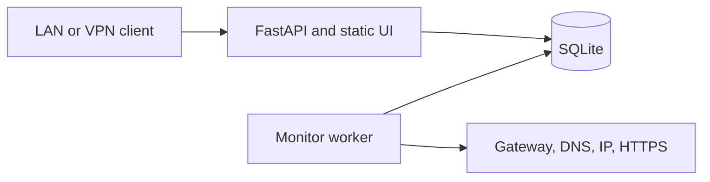

# Architecture and scope

This is a deliberately small, local-first application for Raspberry Pi 3 and
Raspberry Pi 4. Every installation is independent and keeps its own settings,
history, and dashboard.

## V1 components

```mermaid
flowchart LR
    Client[LAN or VPN client]
    Web[FastAPI and static UI]
    DB[(SQLite)]
    Monitor[Monitor worker]
    Targets[Gateway, DNS, IP, HTTPS]

    Client --> Web
    Web --> DB
    Monitor --> DB
    Monitor --> Targets
```

V1 uses two Python processes:

- The **monitor worker** schedules probes, validates routes, classifies rounds,
  maintains incidents and gaps, and performs retention and aggregation.
- The **web process** serves the API and local frontend, reads history, exports
  CSV, validates runtime settings, and runs diagnostic manual probes.

The split ensures that restarting or breaking the dashboard does not stop
monitoring. SQLite in WAL mode is the only coordination mechanism. There is no
message broker, network database, Docker requirement, or cloud dependency.

## Data and configuration

The database is stored on a local persistent filesystem. The monitor writes one
probe round per short transaction. The web process uses separate short-lived
transactions and never modifies scheduled monitoring state.

The root-owned TOML file contains installation identity, database location,
bind settings, routing policy, and defaults. The settings UI stores only
validated timing, probe, and retention overrides in a separate state-directory JSON file.
The web process can write that settings directory but its systemd sandbox keeps
the monitoring database read-only. A saved change requests a worker restart;
systemd then starts the worker with the validated settings.

The worker applies database migrations before monitoring starts. Clock trust is
checked against both the OS synchronization signal and monotonic elapsed time;
untrusted time becomes a monitoring gap rather than an outage claim.

Raw probe rounds default to 7 days. Before expiry, gateway and external-IP ping
samples are compacted into hourly count, average, minimum, and maximum summaries.
These summaries default to 548 days, while incidents default to indefinite
retention. Status intervals and monitoring gaps remain compact long-range data.

## Access

The dashboard is not exposed to the public internet. It is accessed from the
local LAN or after connecting to that location's existing VPN.

Dashboard, history, health, and CSV reads do not require authentication.
The manual probe is bounded, does not persist results, and requires a custom
same-origin request header. V1 has no application login, shared accounts,
single sign-on, administrative settings UI, or central multi-site dashboard.

## Deployment

Production uses a dedicated unprivileged account, one Python virtual
environment, one database, and two systemd units:

- `raspi-network-monitor.service`
- `raspi-network-monitor-api.service`

The application may bind to local IPv4 interfaces for direct LAN and VPN
access. Its port must not be forwarded from the router to the public internet.
Installation must not alter firewall, VPN, routing, storage mounts, or an
existing web server without an explicit operator action.

All frontend assets are local. The Pi needs no Node.js runtime, CDN, Docker, or
internet access to display stored information.

## Raspberry Pi support

The design targets both Pi 3 and Pi 4, with Pi 3 as the intended resource floor.

Current rollout is limited to Raspberry Pi 4 installations. The Pi 3 remains
a design compatibility target, but it has not been tested and no near-term Pi 3
installation is planned. Pi 3 support must not be claimed as validated until a
real-device test is completed.

The first Pi 4 deployment runs the monitor worker as a hardened systemd service.
The web service provides both the graphical dashboard and its read-only API.
It remains disabled until explicitly enabled for an installation.

- Support the actual 32-bit or 64-bit Raspberry Pi OS architectures found in
  the host inventory.
- Keep Python `>=3.9` provisional until the hosts are inventoried.
- Prefer pure-Python dependencies or maintained ARM wheels.
- Use one web worker and bounded probe concurrency.
- Batch database writes and use shorter raw retention on microSD.
- Test on a real Pi 3 and Pi 4 before release.

Initial targets are at most 150 MiB combined resident memory for the monitor and
web processes, below 10 percent average idle use of one Pi 3 core, and no
overlapping probe rounds.

## V1 limitations

V1 deliberately does not include:

- Email notifications or reports.
- Device-level traffic attribution.
- VPN health probes.
- Speed tests.
- Multi-site aggregation or synchronization.
- Shared authentication.
- Grafana, MQTT, or Home Assistant integration.
- Device scanning or traffic capture.

## V2 priorities

The initial V2 order is:

1. Email notifications with a durable outbox, retry, and recovery delivery.
2. Device-level traffic attribution.
3. VPN health probes kept separate from native-WAN availability.
4. Optional, low-frequency, data-budgeted speed tests.

### Deferred email notification design

Email notifications are approved as future work but are not implemented yet.
The monitor will reuse the Raspberry Pi's protected `msmtp` configuration;
sender and SMTP fields do not belong in this application's settings or Git.
`raspi4-01` currently has `msmtp` and `/etc/msmtprc`, but not the reusable
`raspi-notify` queue. Recheck that state before implementation.

The application will keep its own durable notification outbox because delivery
depends on incident state, summaries, recipient policy, and generated graphs. A
hardened root-owned timer will deliver queued mail through `msmtp`, while the
monitor process remains unprivileged and cannot read SMTP credentials. Delivery
must retry safely, prevent duplicates, and combine an unsent start notification
with recovery rather than sending stale messages back-to-back.

Each locally stored recipient can be enabled independently and select an
incident policy: none, start only, end only, start and end, or full lifecycle
including meaningful classification changes. Daily, weekly, and monthly
summaries are separate per-recipient subscriptions. One configurable minimum
event duration applies to incidents and monitoring gaps. Start notifications
wait until that threshold is reached; shorter events send no immediate email.
Monitoring-gap mail is evaluated after monitoring resumes.

Template design remains a separate collaborative step. The planned email has
HTML and plain-text forms, with compact overall-status and ping-latency graphs
for both the preceding hour and seven days. Graphs should be embedded rather
than loaded from an external service. No real recipient address or mail secret
may be committed.

### Deferred speed-test design

Speed tests are approved as future work but are not implemented yet. They are
performance measurements, not availability evidence, and must never feed the
incident classifier. The preferred first engine is the open-source LibreSpeed
CLI because it offers structured JSON, physical-interface binding, fixed-server
selection, and controls for duration, chunks, and upload size. Sharing and
telemetry remain disabled. Ookla's official CLI is an alternative if broader
server coverage becomes more important than per-test data controls.

A scheduled test may start only while the stable state is online, no incident
or confirmation transition is active, native connectivity has been stable for
at least five minutes, no other test is running, and the monthly data budget is
available. It runs immediately after a normal monitoring round, binds to the
physical interface, has a hard overall timeout, and is followed by another
normal round. Monitoring rounds and speed tests must not overlap.

Initial proposed defaults are one daily test at 04:00 local time, eight seconds
each for download and upload, a 30-second overall timeout, a 20 GB monthly data
budget, and 548 days of result retention. Settings should support manual-only,
daily, or weekly schedules; local execution time; fixed server ID; test
duration; monthly data budget; retention; and an explicit manual-run action.
The manual action must warn that it can temporarily consume significant
bandwidth.

Each installation should pin one reviewed nearby server so results remain
comparable. Store its ID and name with each result. An unavailable server
produces a failed test rather than silently changing the baseline; any future
fallback must be explicit and identifiable in history.

Persist start and completion time, download and upload Mbps, ping, jitter,
transferred byte counts, server ID and name, physical interface, outcome,
bounded failure reason, and tool version. Do not retain the public IP address,
share-result URL, ISP or geolocation metadata, or raw command output. Compact
results can follow the 548-day latency-summary retention period.

The dashboard should show the latest result, last-success time, current-month
data use, and a download/upload history chart with 7-day, 30-day, and one-year
windows. Failed and skipped tests should be visible without being plotted as
zero throughput. Tooltips should include time, values, and server name. The
measurement represents performance available to that Raspberry Pi through its
interface and selected server, not an absolute ISP-line capability.

Traffic attribution needs a feasibility study because the routers expose no
usable API. A Pi connected as an ordinary LAN endpoint cannot observe other
devices' traffic. It would require a deliberate visibility method such as a
gateway/bridge role, a managed-switch mirror port, endpoint agents, or separate
monitoring hardware. No option should put household internet reliability at
risk, and full packet payload retention is not a goal.

Central aggregation, shared login, Grafana, MQTT, and Home Assistant remain
optional after V2.

The dashboard setting can hide completed incidents and monitoring gaps shorter
than one minute from its two preview lists. It only changes presentation; short
events remain stored and included in complete history and CSV export.
Detailed combined incident and monitoring-gap history includes filtering,
pagination, expandable diagnostics, and filtered CSV export. Incident notes
remain optional follow-up work.
Consecutive incident records linked by a `category_transition` are one
user-facing incident with multiple classification phases. The individual phase
records remain intact for diagnostics, and no healthy interval is invented
between them.
MTBF is calculated for the selected timeline window as classified online time
divided by confirmed incident starts. Monitoring gaps and other unknown time
are excluded, and classification phases in one continuous incident count once.
